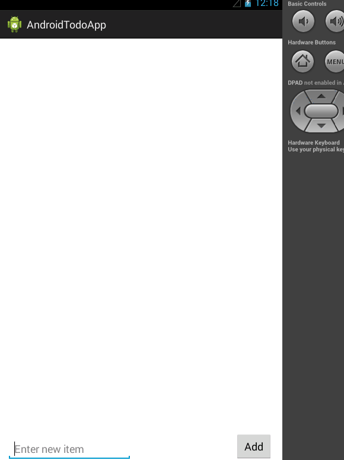

Sample Todo Android App
==============
This is an Android demo application for managing Todos

Time spent: x hours spent in total

Completed user stories:

  * [x] Required: User can view a list of existing todo items
  * [x] Required: User can add a new item to the todo list
  * [x] Required: User can remove an item from the todo list

Walkthrough:

